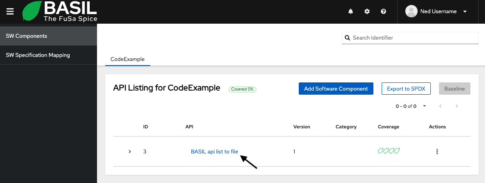
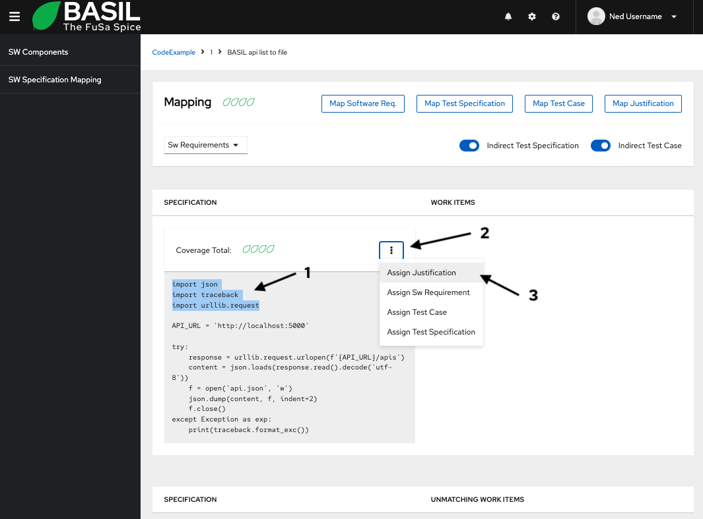
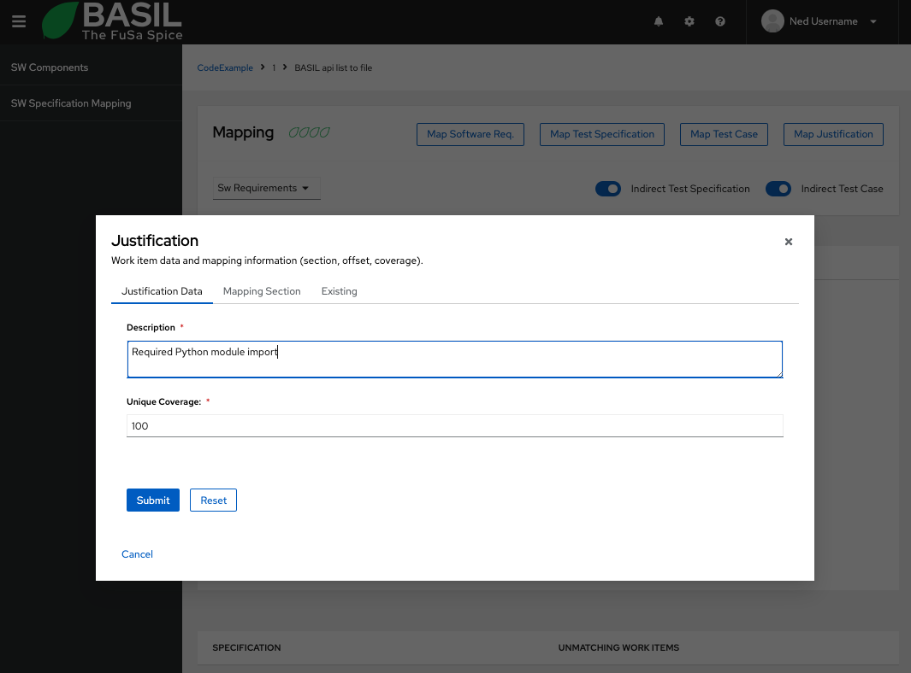
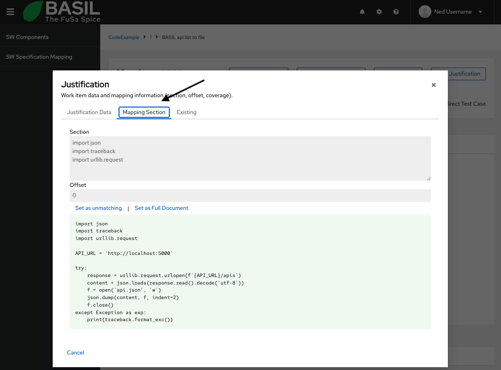
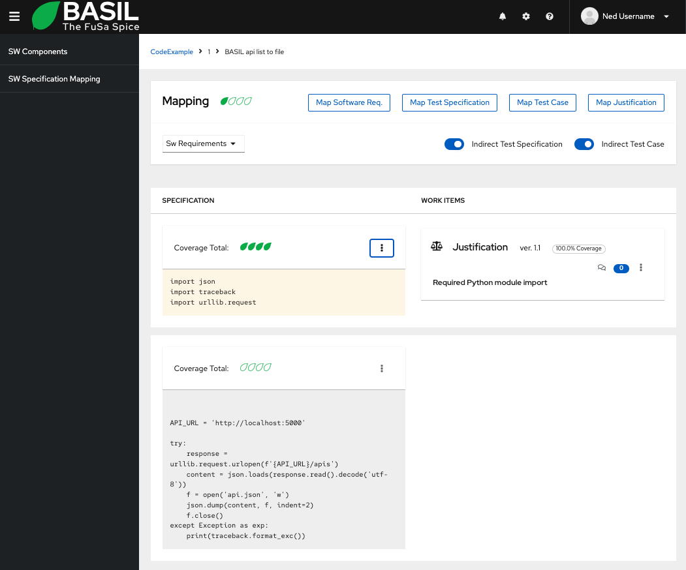

.. image:: ../../app/src/app/bgimages/basil_black.svg

How does it works?
=================================

.. toctree::
   :maxdepth: 2
   :caption: Contents:

-------------------
Software Components
-------------------

BASIL home page will show the list of Software Components organized by libraries.
You can move between different libraries and use the search field at the top right of the screen to filter over the proposed list.

.. image:: _static/_images/sw_components.png
  :alt: BASIL Software Components list
  :align: center
  :width: 100%

Add a new Software Component
^^^^^^^^^^^^^^^^^^^^^^^^^^^^

To add a new Software Component click on the **Add Software Component** button at the top right of the screen.
A new window will pop up.

To create a new Software Component you have to fill all mandatory fields and click **Confirm**.

The **Specification Url/Path** field define the document that you want to use as reference for you work items.
In other words you will be able to create a relationship between any work item and a section of your choice of that document.
The document can be a Sw Specification document or a Source Code file or any other plain text document do you want.

-----------------
Work Item Mapping
-----------------

Create your first Work Item
^^^^^^^^^^^^^^^^^^^^^^^^^^^

Once you have a software component you can start creating work items and defining the mapping relation to the Specification file.
On doing so, click on the Sw Component name you just created.

You will be redirected to another view where you will se on the left side the Specification document.
Let's create a Justification work item.

Select a piece of the Specification document as the following example and click on the kebab menu icon on top of the Specification document section.
Select **Assign a Justification** from the menu.

A modal view will pop up.
Fill the **description** field with the desired justification you want to assign to the selected section and assign a coverage percentage to this work item.

In the **Mapping Section** tab you can check that the selected section of the Specification assigned to the current work item is as you want and you will be able to edit it before creating the work item.

Once you are ready, go back to the **Justification Data** tab and click **Submit**.

Now the Specification document is divided into different sections.
One has a Justification assigned to it, and the other one has no work items assigned.

The same way you can define other work items like Software Requirements, Test Specifications, Test Cases.

Edit an existing Software Component
^^^^^^^^^^^^^^^^^^^^^^^^^^^^^^^^^^^

To edit a Software Component, click the **>** symbol on the relative row.
That will expand a view where you will be able edit the Software Component.
On doing so you will be able to see all the modification applied to it along the way.

Check work items against a new version of the Specification
^^^^^^^^^^^^^^^^^^^^^^^^^^^^^^^^^^^^^^^^^^^^^^^^^^^^^^^^^^^

To check work items mapping against a new version of a Software Specification you can click the 3 dots menu button under the column **Action** on the row of the desired Software Component.
That will show a contextual menu where you can select **Check Spec**.
Another view will pop up with a form filled with data from the current version.
Here you can specify the url or the absolute path of the new Specification.
To perform the analysis click **Confirm**.
Once the analysis is completed you will see a report where for each work items you can have:

+ OK : The mapped section exists in the new Specification in the same position
+ KO : The exact mapping doesn't exists in the new Specification
+ Warnings : The mapped section exists in the new Specification in another position

Fork a new version of the Software Component
^^^^^^^^^^^^^^^^^^^^^^^^^^^^^^^^^^^^^^^^^^^^

To create a new version of a Software Component you can click the 3 dots menu button under the column action on the row of the desired Software Component.
That will show a contextual menu where you can select **New Version**.
Another view will pop up partially filled with data from the current version.
In that Form you can add the new version value and click **Confirm**.
That will create a new Software Component and will fork all the direct mapping of work items against the specification.
This way all the changes to work items to the new version doesn't affect the work items in the previous version.

Fix warnings of work items mapping in a new Software Component version
^^^^^^^^^^^^^^^^^^^^^^^^^^^^^^^^^^^^^^^^^^^^^^^^^^^^^^^^^^^^^^^^^^^^^^

The workflow to create a new version and fix mapping warnings is following:

+ Once you have a new Specification for the selected Software Component you can check the new specification as explained at *Check work items against a new version of the Specification*.
+ Create a new version of the Software Component as explained at *Fork a new version of the Software Component*
+ At this point you will have something to fix!
  To Fix all the mapping warnings you can click the 3 dots menu button under the column action on the row of the desired Software Component.
  That will show a contextual menu where you can select **Check Spec**.
  Another view will pop up partially filled with data from the current version.
  Only if the Specification Url/Path is the one of the Software Component you will see the button **Fix Warnings** enabled.
  Click the **Fix Warnings** button and all the work items section offset will be fixed.

Export library data in SPDX format
^^^^^^^^^^^^^^^^^^^^^^^^^^^^^^^^^^

It is possible to export all the information related to a desired library in SPDX (JSON) format clicking the **Export to SPDX** button.
