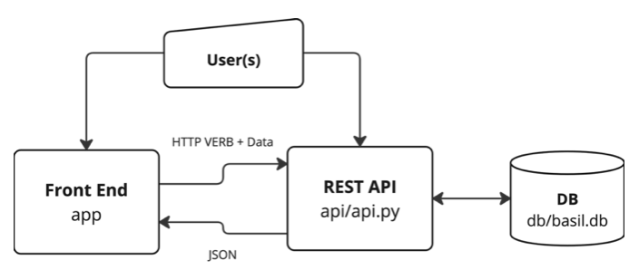

How to run it
=================================

------------
Architecture
------------

**BASIL** consists of three pieces:

+ A Web Rest API
+ A Web Front End Application
+ A Database (default sqlite)

-----------------
Docker Containers
-----------------

You can deploy BASIL via Docker using Dockerfile-api and Dockerfile-app provided as part of the source code.

# Build the Containers
^^^^^^^^^^^^^^^^^^^^^^

You can build the API project using the Dockerfile-api.

Building this container you will also initialize the database.

If you need to host BASIL on a server you should specify following build argument:

 + API_PORT (default is 5000)

BASIL will be configured with an admin user named **admin**.
You can specify the **admin** user password with the following build argument:

 + ADMIN_PASSWORD (default is **admin**)

Here an example of docker build command:

.. code-block:: bash

   docker build \
      --build-arg ADMIN_PASSWORD=your-desired-password \
      --build-arg API_PORT=1234 \
      -f Dockerfile-api \
      -t basil-api-image .

At the same way you can build the APP project using Dockerfile-app

To be able to reach the API project you need to specify the following build argument:

 + API_ENDPOINT (e.g. http://api-server-it:yourport or http://api-server-it/reverse-proxy-route)

.. code-block:: bash

   docker build \
      --build-arg API_ENDPOINT=http://api-server-url:yourport \
      -f Dockerfile-app \
      -t basil-app-image .

NOTE: API_ENDPOINT must start with http

# Docker Volumes
^^^^^^^^^^^^^^^^

In order to keep persistent data you can specify following volumes:

.. code-block:: bash

   docker volume create basil-db-vol
   docker volume create basil-ssh-keys-vol
   docker volume create basil-tmt-logs-vol

# Start the Containers
^^^^^^^^^^^^^^^^^^^^^^

You can start the API Container above created with the name **basil-api-image** with the following docker command

.. code-block:: bash

   docker run \
      -d \
      --privileged \
      --network=host \
      --name basil-api-container \
      --mount source=basil-db-vol,target=/BASIL-API/db \
      --mount source=basil-ssh-keys-vol,target=/BASIL-API/api/ssh_keys \
      --mount source=basil-tmt-logs-vol,target=/var/tmp/tmt \
      basil-api-image

the ``--privileged`` options is needed to be able to run fedora container as a possible testing environment inside the basil-api-container.

You can start the APP Container above created with the name **basil-app-image** with the following docker command

.. code-block:: bash

   docker run \
      -d \
      --network=host \
      --name basil-app-container \
      basil-app-image

# Check Containers Status
^^^^^^^^^^^^^^^^^^^^^^^^^

You can list running containers with the following docker command

.. code-block:: bash

   docker ps

# Backup BASIL DB from Container
^^^^^^^^^^^^^^^^^^^^^^^^^^^^^^^^

Only the API project is able to interact with the database and the db and due to that you should refer to the **basil-api** container.
You can copy the db file locally with the following docker command:

.. code-block:: bash

   docker cp basil-api-container:/BASIL-API/db/basil.db </YOUR/LOCAL/LOCATION>

# Stop Containers
^^^^^^^^^^^^^^^^^
You can stop running containers, the one that you can see listed with the **ps** docker command using the following syntax:

.. code-block:: bash

   docker stop basil-api-container
   docker stop basil-app-container

.. toctree::
   :maxdepth: 1
   :caption: Contents:
