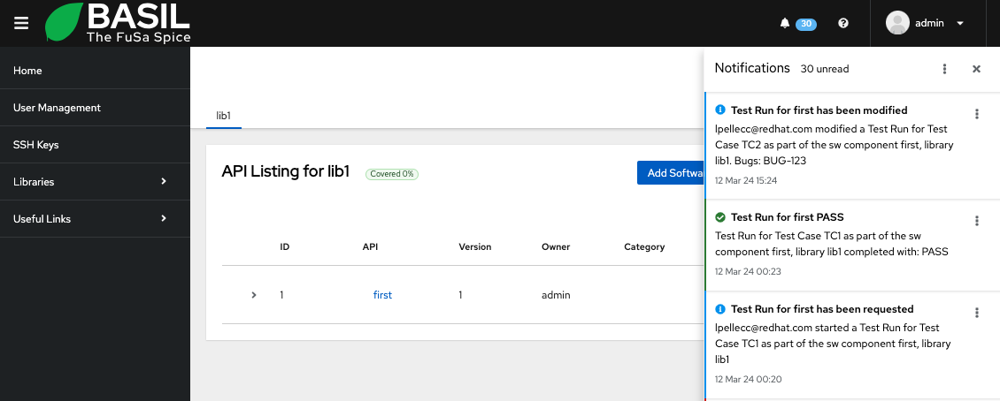

.. image:: ../../app/src/app/bgimages/basil_black.svg

Notifications
=============

Any change to a Software Component will generate a Notification.
For example, creating a new Software Requirement, adding a Comment, running a Test Case.
To be able to be notified about such events a user should enable notifications for the desired Software Component.
Using the Software Component 3 dots menu in the page that list all the Software Components for the desired software library you can select 'Enable notification'/'Disable notification'.
If the notifications are enabled for a selected Software component you will see a Bell icon in the relative row.

To access the Notifications detail you can click on the Bell icon in the top menu, close to the avatar icon.
That will show a menu on the right side of the page with the list of all unread notifications.

From here you can set one or all the notifications as read and close the menu.

.. toctree::
   :maxdepth: 1
   :caption: Contents:
