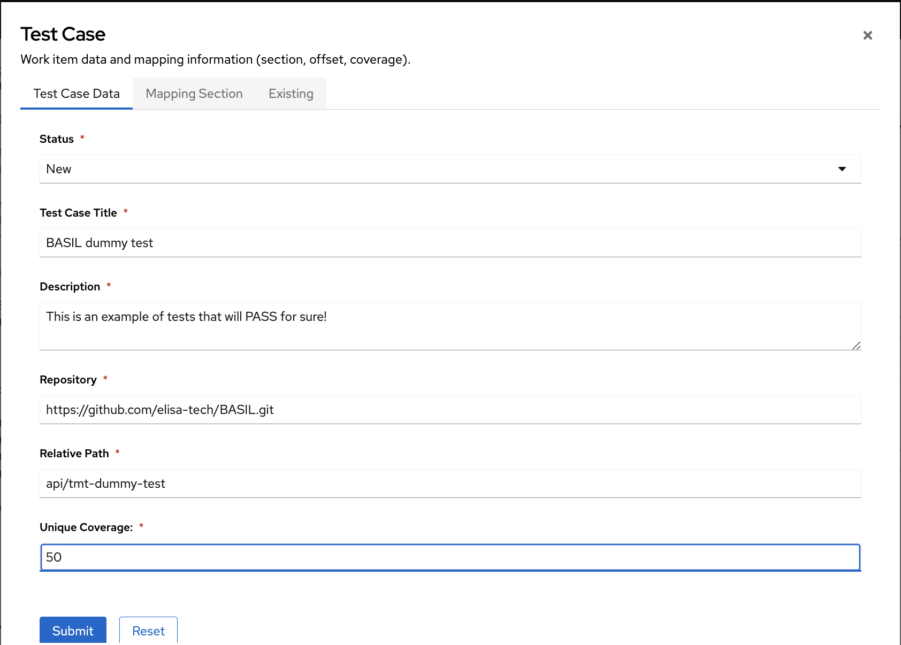
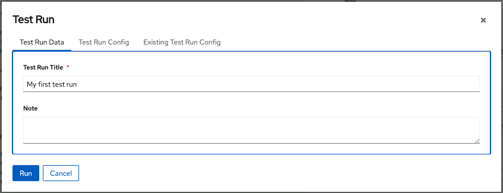
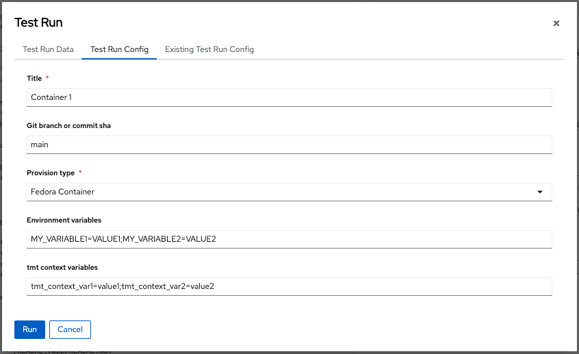
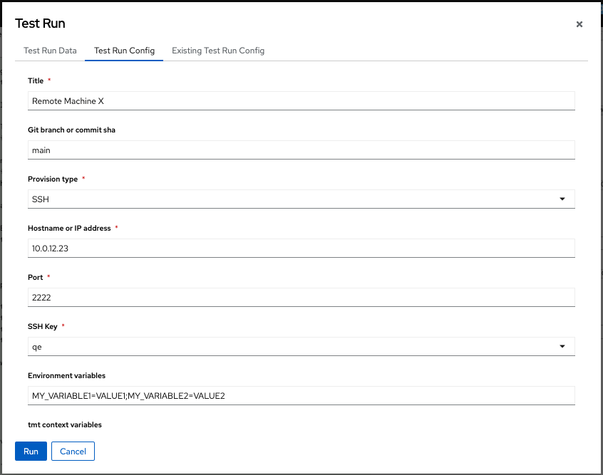
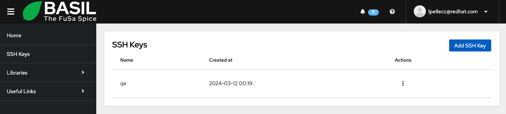
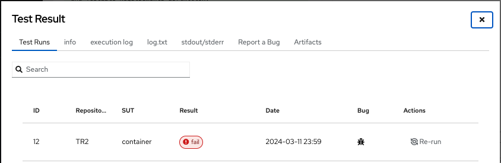
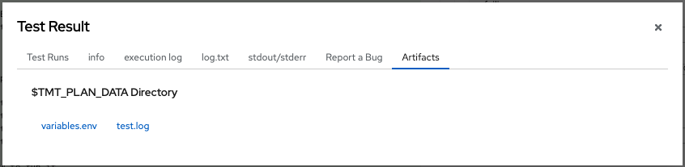

.. image:: ../../app/src/app/bgimages/basil_black.svg

Test Run and Test Results
=========================

---
tmt
---

BASIL is using `tmt <https://tmt.readthedocs.io/en/stable/>`_ as Test Management Tool.

**tmt** introduce a level of abstraction that allow BASIL to run any kind of test.

To be able to run a test you have to specify the git repository where the test lives and that repo should implement **tmt**.
What that does mean?
You need to run the

.. code-block:: bash

   tmt init

command in the root folder of your repo to create the needed metadata!

Your git repository can host thousands of tests, so how you can specify which one you are looking for?
You can describe each test with an **fmf** metadata file.
On doing so you can add several information like a description, tags, an expected duration, required libraries and packages, the test entry point and so on.
See the **tmt** documentation for all the details.

Once you created a test **fmf** metadata file you can verify it using the following command:

.. code-block:: bash

   tmt lint

What is missed here?
We need to specify where the test lives inside the repo.
On doing so we can ask **tmt** to list all the tests and check what value we should specify for the **relative path** field in BASIL.

.. code-block:: bash

   tmt test ls

Pay attention that **tmt** works with string matching, so, if you look at the following example:

.. code-block:: bash

   /testcases/library_x/functionality_a/test_1
   /testcases/library_x/functionality_a/test_2
   /testcases/library_x/functionality_b/test_1
   /testcases/library_x/functionality_c/test_1
   /testcases/library_y/functionality_a/test_1

you can run test_1 of functionality_a of library_x specifying the relative path:

.. code-block:: bash

   /testcases/library_x/functionality_a/test_1

or you can run all tests of functionality_a of library_x using:

.. code-block:: bash

   /testcases/library_x/functionality_a

or you can run all tests of functionality_a of library_x and library_y using:

.. code-block:: bash

   functionality_a

If you'd like to implement a 1:1 relation you can also specify a regex like:

.. code-block:: bash

   ^/testcases/library_x/functionality_a/test_1$

That will help you on scaling and modifying the structure of your test repository folders without affecting BASIL work items definitions.

--------
Test Run
--------

You can run a test clicking on the "Run" button in the Test Case menu.
A modal window will show up to let you able to configure the run.
You can specify a title and add your notes, mostly to be able to identify it later.

Once you defined the test run title is time to specify the test run configuration.
You can create a new one or re-use an existing one.

BASIL support 2 different provisioning types:

 + Fedora Container
 + Remote machine via SSH

To be able to run a test in a Fedora Container you should deploy BASIL following the instruction provided in **How to run it**.
We will see in details both provisioning types, but let take a look to other fields that you can specify in this page.

 + Title
 + Git branch or commit sha (of the git test repository)
 + Environment variables (to allow you to enable different logic on the test side)
 + tmt context variables (to allow you to enable different logic in the tmt test)

Pay attention that BASIL is automatically exporting some environment variables that you can leverage in you tmt test:
 + basil_test_case_id: ID of the Test Case
 + basil_test_case_title: Title of the Test Case
 + basil_api_api: Name of the Sw component (api)
 + basil_api_library: Library of the Sw Component
 + basil_api_library_version: Library Version of the Sw Component
 + basil_test_case_mapping_table: Parent Type of the Test Case
 + basil_test_case_mapping_id: Parent ID of the Test Case
 + basil_test_relative_path: Relative Path of the Test Case inside the test repository
 + basil_test_repo_path: Path of the Test Case repository
 + basil_test_repo_url: Url of the Test Case repository
 + basil_test_repo_ref: Ref (branch or commit sha) of the Test Case repository
 + basil_test_run_id: UID of the Test Run
 + basil_test_run_title: Title of the Test Run
 + basil_test_run_config_id: ID of the Test Run Configuration
 + basil_test_run_config_title: Title of the Test Run Configuration
 + basil_user_email: Email of the User that created the Test Run

Any other environment variable can be added by default in your BASIL instance customizing the api/tmttestrun.py file at TmtTestRunner() class initialization.

# Test in Fedora Container
^^^^^^^^^^^^^^^^^^^^^^^^^^

Selecting **Fedora Container** as provisioning type you will trigger the execution against a that environment that runs as part of the BASIL deployment.
That is possible thanks to the package tmt[provision-container].

# Test via SSH
^^^^^^^^^^^^^^

To be able to run your test against a remote machine via SSH you need to specify following parameters:

 + Hostname or IP address
 + SSH Port
 + SSH Private Key

You can select the SSH Private Key from a menu that will list all the keys that you have specified in your user profile.
You can reach the SSH Keys management page clicking on the avatar icon on top right of the page or using the side menu.

Once ready, press **Run**.

-----------------
Test Results
-----------------

# Navigate Runs
^^^^^^^^^^^^^^^

Once you requested a test case run the window will disappear. That's normal!

To see the test results or to follow the execution of a test you should open the Test Results page of the desired Test Case using its own 3 dots menu.

Once in that page you will see a table with the list of all the runs.

Here you can filter test results with a free text field that will search across relevant informations.

Moreover from that view you can understand if a Bug was filed after a Test Run and you can Re-Run any previous job.

Pay attention here that if a a Test Run was executed via SSH and you delete the SSH Key used at that time, BASIL will not be able to trigger the execution.
In that case from the Test Run view, you can Re-Use that particular test run configuration, changing the SSH Key with a fresh one and press 'Run'.

To access Test Result information, you can click on the row of the desired one.

That will load the data that you can navigate in all other tabs:

 + Info (Details of the Test Run and of the Test Run Configuration)
 + execution log (Here you can see a log of the code that start tmt request, it is useful in case of exceptions)
 + log.txt (Verbose tmt log that completely describe the test execution)
 + stdout/stderr (stdout and stderr of the tmt request)
 + Report a Bug (to add/edit Bug reference and Notes, if bugs filed is populated that will show an icon in the Test Results table)
 + Artifacts (where you see artifacts generated by test execution)

# Bugs
^^^^^^

# Artifacts
^^^^^^^^^^^

In the Artifacts tab you will see the list of all the files that are generated by the test in the $TMT_PLAN_DATA folder.

So if you need to collect a particular evidence, you can copy it, during the test execution, in the location provided by that environment variable that will be automatically generated by tmt.

----------------
# BASIL tmt plan
----------------

To let **tmt** able to discover any test, BASIL implements a general purpose **tmt plan**.

It is available at **BASIL/api/tmt-plan.fmf**.

It is using environment variables to describe the git repository url, branch and relative path and those variable are passed by the test plugin BASIL/api/tmttestrun.py

If all your tests need to apply some preparation/finish steps you can extend this tmt-plan.fmf accordingly.

------------
# User Roles
------------

Not all the users can request a test execution in BASIL and that depends on the user Role.

Let see all the roles and their permissions in regard of the test execution:

 + **ADMIN**:

   - can access the Test Result information if have read permission to the Software Component.

   - can request a Test Run and edit Note and Bugs if he has read/write permission to the Software Component.

 + **GUEST**:

   - can access the Test Result information if has read permission to the Software Component.

 + **USER**:

   - can access the Test Result information if has read permission to the Software Component.

   - can request a Test Run and edit Note and Bugs if he has read/write permission to the Software Component.

.. toctree::
   :maxdepth: 3
   :caption: Contents:
