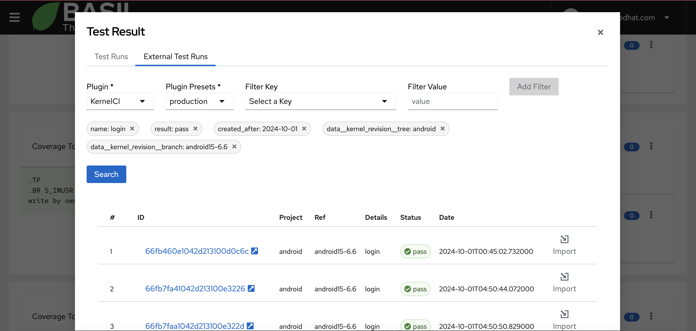

.. image:: ../../app/src/app/bgimages/basil_black.svg

Test Runs and Test Results
==========================

BASIL test infrastructure is based on the `tmt <https://tmt.readthedocs.io/en/stable/>`_ project.

tmt is the acronym of Test Management Tool.

It's a python module that provide an abstraction layer to be able to interact and execute any kind of test suites, regardless of the programming language they are implemented in.
Moreover it provides provisioning features to be able to execute the desider tests against vaiours test environments such as container, virtual machines or physical hardwares.

To summarize, if you want to run a test from BASIL you need to create an fmf file for your test that describes its entrypoint and dependencies in terms of required packages and libraries.

Starting from version 1.5, BASIL is extending its testing capabilities to external infrastructures.
Main reason behind that is that, sometimes, a company or an open source project introduces a tool like BASIL in the middle of the development.
That means they already have their own test infrastructure configured and with high probability its a complex one.
So, instead of asking for a migration effort, we can leverage existing test infrastrucutre and just link external test results to BASIL Test Cases to estabilish the required traceability matrix.

What is actually supported?

+----------------+---------------------------+------------------+---------------------+
|     Plugin     | Trigger Monitor and Trace | Filter and Trace | Test Infrastructure |
+================+===========================+==================+=====================+
|      tmt       |           Yes             |       Yes        |      Embedded       |
+----------------+---------------------------+------------------+---------------------+
|  Testing Farm  |           Yes             |       No         |      External       |
+----------------+---------------------------+------------------+---------------------+
|   Gitlab CI    |           Yes             |       Yes        |      External       |
+----------------+---------------------------+------------------+---------------------+
| Github Actions |           Yes             |       Yes        |      External       |
+----------------+---------------------------+------------------+---------------------+
|    KernelCI    |            No             |       Yes        |      External       |
+----------------+---------------------------+------------------+---------------------+

Trigger, Monitor and Trace: Trigger test execution on the external test infrastructure, follow the test execution and trace the test result to a BASIL Test Case.

Filter and Trace: Navigate and filter test results executed on the external test infrastructure and trace them to a BASIL Test Case.

---
tmt
---

BASIL internal test infrastructure is based on `tmt <https://tmt.readthedocs.io/en/stable/>`_ a Test Management Tool.

**tmt** introduce a level of abstraction that allow BASIL to run any kind of test.

To be able to run a test you have to specify the git repository where the test lives and that repo should implement **tmt**.
What that does mean?
You need to run the

.. code-block:: bash

   tmt init

command in the root folder of your repo to create the needed metadata!

Your git repository can host thousands of tests, so how you can specify which one you are looking for?
You can describe each test with an **fmf** metadata file.
On doing so you can add several information like a description, tags, an expected duration, required libraries and packages, the test entry point and so on.
See the **tmt** documentation for all the details.

Once you created a test **fmf** metadata file you can verify it using the following command:

.. code-block:: bash

   tmt lint

What is missed here?
We need to specify where the test lives inside the repo.
On doing so we can ask **tmt** to list all the tests and check what value we should specify for the **relative path** field in BASIL.

.. code-block:: bash

   tmt test ls

Pay attention that **tmt** works with string matching, so, if you look at the following example:

.. code-block:: bash

   /testcases/library_x/functionality_a/test_1
   /testcases/library_x/functionality_a/test_2
   /testcases/library_x/functionality_b/test_1
   /testcases/library_x/functionality_c/test_1
   /testcases/library_y/functionality_a/test_1

you can run test_1 of functionality_a of library_x specifying the relative path:

.. code-block:: bash

   /testcases/library_x/functionality_a/test_1

or you can run all tests of functionality_a of library_x using:

.. code-block:: bash

   /testcases/library_x/functionality_a

or you can run all tests of functionality_a of library_x and library_y using:

.. code-block:: bash

   functionality_a

If you'd like to implement a 1:1 relation you can also specify a regex like:

.. code-block:: bash

   ^/testcases/library_x/functionality_a/test_1$

That will help you on scaling and modifying the structure of your test repository folders without affecting BASIL work items definitions.

.. image:: _static/_images/test_case_tmt.png
  :alt: BASIL Test Case tmt
  :align: center
  :width: 100%

# BASIL tmt plan
^^^^^^^^^^^^^^^^

To run a test with **tmt** we need to specify a **tmt plan**.

A **tmtm** plan is an **fmf** file that describes which tests we want to run, which preparation and finish steps we want to apply to the System Under Test, which report we want to generate and more.

In a **tmt** plan we can filter tests from git repositories with different criteria under the **discover** statement.

To let **tmt** able to discover any test in BASIL, we created a general purpose **tmt plan**.

It is available at **BASIL/api/tmt-plan.fmf**.

It is using environment variables to describe the git repository url, the branch and then relative path and those variable are passed by the test plugin BASIL/api/testrun_tmt.py

If all your tests need to apply some preparation/finish steps you can extend this **BASIL/api/tmt-plan.fmf** accordingly.

Test Run
^^^^^^^^

You can run a test clicking on the "Run" button in the Test Case menu.
A modal window will show up to let you able to configure the run.
You can specify a title and add your notes, mostly to be able to identify it later.

.. image:: _static/_images/test_run1.png
  :alt: BASIL Test Run
  :align: center
  :width: 100%

Once you defined the test run title is time to specify the test run configuration.
You can create a new one or re-use an existing one.

BASIL *tmt* plugin supports 2 different provisioning types:

 + Fedora Container
 + Remote machine via SSH

To be able to run a test in a Fedora Container you should deploy BASIL following the instruction provided in **How to run it**.
We will see in details both provisioning types, but let take a look to other fields that you can specify in this page.

 + Title
 + Git branch or commit sha (of the git test repository)
 + Environment variables (to allow you to enable different logic on the test side)
 + tmt context variables (to allow you to enable different logic in the tmt test)

Pay attention that BASIL is automatically exporting some environment variables that you can leverage in you tmt test:
 + basil_test_case_id: ID of the Test Case
 + basil_test_case_title: Title of the Test Case
 + basil_api_api: Name of the Sw component (api)
 + basil_api_library: Library of the Sw Component
 + basil_api_library_version: Library Version of the Sw Component
 + basil_test_case_mapping_table: Parent Type of the Test Case
 + basil_test_case_mapping_id: Parent ID of the Test Case
 + basil_test_relative_path: Relative Path of the Test Case inside the test repository
 + basil_test_repo_path: Path of the Test Case repository
 + basil_test_repo_url: Url of the Test Case repository
 + basil_test_repo_ref: Ref (branch or commit sha) of the Test Case repository
 + basil_test_run_id: UID of the Test Run
 + basil_test_run_title: Title of the Test Run
 + basil_test_run_config_id: ID of the Test Run Configuration
 + basil_test_run_config_title: Title of the Test Run Configuration
 + basil_user_email: Email of the User that created the Test Run

Any other environment variable can be added by default in your BASIL instance customizing the api/testrun_tmt.py file at TestRunnerTmtPlugin() class initialization.

# Test in Fedora Container
^^^^^^^^^^^^^^^^^^^^^^^^^^

Selecting **Fedora Container** as provisioning type you will trigger the execution against that environment that runs as part of the BASIL deployment.
That is possible thanks to the package tmt[provision-container].

.. image:: _static/_images/test_run_config_container.png
  :alt: BASIL Test Run Config Container
  :align: center
  :width: 100%

# Test via SSH
^^^^^^^^^^^^^^

To be able to run your test against a remote machine via SSH you need to specify following parameters:

 + Hostname or IP address
 + SSH Port
 + SSH Private Key

.. image:: _static/_images/test_run_config_ssh.png
  :alt: BASIL Test Run Config SSH
  :align: center
  :width: 100%

You can select the SSH Private Key from a menu that will list all the keys that you have specified in your user profile.
You can reach the SSH Keys management page clicking on the avatar icon on top right of the page or using the side menu.

.. image:: _static/_images/user_ssh_keys.png
  :alt: BASIL User SSH Keys
  :align: center
  :width: 100%

Once ready, press **Run**.

---------
Gitlab CI
---------

You can use BASIL to run a test in your gitlab pipeline.
On doing so you can specify a gitlab ci plugin preset as done in the following example:

.. code-block:: yaml

  gitlab_ci:
    - name: lpellecc-ci-training
      url: https://www.gitlab.com/
      git_repo_ref: main
      project_id: 64922856
      trigger_token: !ENV ${GITLAB_CI_64922856_TRIGGER_TOKEN}
      private_token: !ENV ${GITLAB_CI_64922856_PRIVATE_TOKEN}
      stage: test
      job: unit-test-job
      env:
        var1: value1
        var2: value2

Note: name, url, git_repo_ref, trigger_token, private_token are mandatory fields.
      If you specify the `stage` statement, the plugin will check that all the jobs of that stage succeded.
      If you specify the `stage` statement and `job` statement, the plugin will check that, the job you selected
      is part of the selected stage and the job succeded.
      Filtering external test results, updated_after and updated_before fields format is YYYY-MM-DD.

You can use the same plugin preset configuration to navigate pipelines execution and trace a test run to your BASIL test case.
On doing that you can apply additional filters.

Click the Test Case menu and then Test Results. Oce the Test Results modal appears, select the tab `External Test Runs`.
Then select the `gitlab ci` plugin and then the desired preset. Apply additional filter if needed and click `Add Filter`.
Once you have all the filter in place, click `Search`.

You can open the gitlab pipeline details page by clicking on the link provided on each line.
Once you identified the right test run, you can click on `import` to trace it to your test case.

--------------
Githib Actions
--------------

You can use BASIL to run a test in your github pipeline.
On doing so you can specify a github actions plugin preset as done in the following example:

.. code-block:: yaml

  github_actions:
    - name: basil-test
      url: https://www.github.com/elisa-tech/BASIL
      git_repo_ref: main
      private_token: !ENV ${GITHUB_ACTIONS_BASIL_PRIVATE_TOKEN}
      workflow_id: build.yaml
      job: test
      inputs:
        uuid: XXX-YYY-ZZZ

Note: name, url, git_repo_ref, private_token, workflow_id are mandatory fields.
      If you specify the `job` statement, the plugin will check that, the job you selected succeded.
      Otherwise the plugin will check that all the jobs of the pipleine succeded.
      If your pipeline need some inputs, you can add them under the `inputs` statement.
      Pay attention that github only accept inputs configured in the repository. If you add input not supported the trigger can fail.

To change the run name using the uuid variable from the inputs statement, you can configure your workflow as following:

.. code-block:: yaml

  name: ci
  run-name: ci [${{ inputs.uuid && inputs.uuid || 'N/A' }}]

  on:
    push:
    workflow_dispatch:
      inputs:
        uuid:
          description: 'Unique ID'
          required: false

You can use the same plugin preset configuration to navigate pipelines execution and trace a test run to your BASIL test case.
On doing that you can apply additional filters.

Click the Test Case menu and then Test Results. Oce the Test Results modal appears, select the tab `External Test Runs`.
Then select the `gitlab ci` plugin and then the desired preset. Apply additional filter if needed and click `Add Filter`.
Once you have all the filter in place, click `Search`.

You can open the github actions pipeline details page by clicking on the link provided on each line.
Once you identified the right test run, you can click on `import` to trace it to your test case.

--------
KernelCI
--------

`KernelCI <https://kernelci.org/>`_ is a community-based open source distributed test automation system.
It is focused on the upstream kernel development and the test execution is CI oriented.
That means the tests are triggered on commit.

From BASIL a user can navigate the KernelCI Database to be able to select the desired test run to link to a Test Case.

On doing so you can specify a plugin preset in your BASIL instance as the following:

.. code-block:: yaml

  KernelCI:
    - name: production
      url: https://kernelci-api.westus3.cloudapp.azure.com/latest
      private_token: !ENV ${KERNEL_CI_PROD_TOKEN}

Note: name, url and private_token are mandatory fields.
      created_after and created_before fields format is YYYY-MM-DD

------------
Testing Farm
------------
Testing Farm is an open-source testing system offered as a service. It has been designed and is maintained by Red Hat.
Testing Farm uses tmt as Test Management tool. That means that each tests should be described by an fmf metadata file and tests should be collected in tmt plans.

To learn more about Testing Farm, refer to the official `Testing Farm documentation <https://docs.testing-farm.io/Testing%20Farm/0.1/index.html>`_.

Useful link: `Testing Farm repository <https://gitlab.com/testing-farm>`_

You can use BASIL to run a test against Testing Farm.
On doing so you can specify a plugin preset in your BASIL instance as the following:

.. code-block:: yaml

  testing_farm:
    - name: public_ranch
      arch: x86_64
      compose: Fedora-40
      private_token: !ENV ${TESTING_FARM_API_TOKEN}
      url: https://api.dev.testing-farm.io/v0.1/requests
      context:
        context_variable1: value1
        context_variable2: value2
      env:
        environment_variable1: value1
        environment_variable2: value2

Note: name, arch, compose, private_token and url are mandatory fields.

By default, BASIL will use the general purpose tmt plan avaiable at `api/tmt-plan.fmf`.
This plan is using environment variables to specify the git repository, the branch and the tmt test name as following:

.. code-block:: yaml

  - discover+:
    - name: General purpose discover
      how: fmf
      url: $basil_test_repo_url
      ref: $basil_test_repo_ref
      test:
        - $basil_test_relative_path

Those variables are automatically populated by BASIL plugin from the Test Case information as:

`
basil_test_repo_url = test_case.repository
basil_test_relative_path = test_case.relative_path

basil_test_repo_ref = From Preset or From Test Run Connfiguration as per user needs
`

-----------------
Test Results
-----------------

# Navigate Runs
^^^^^^^^^^^^^^^

Once you requested a test case run the window will disappear. That's normal!

To see the test results or to follow the execution of a test you should open the Test Results page of the desired Test Case using its own 3 dots menu.

Once in that page you will see a table with the list of all the runs.

Here you can filter test results with a free text field that will search across relevant informations.

Moreover from that view you can understand if a Bug was filed after a Test Run and you can Re-Run any previous job.

Pay attention here that if a Test Run was executed via SSH and you delete the SSH Key used at that time, BASIL will not be able to trigger the execution via Re-Run.
In that case from the Test Run view, you can Re-Use that particular test run configuration, changing the SSH Key with a fresh one and press 'Run'.

To access the Test Result information, you can click the Details button on the right side of the desired row.

You will be able to see:

 + Info (Details of the Test Run and of the Test Run Configuration)
 + Log
 + Report a Bug /Fixes and edit Notes
 + Artifacts (where you see artifacts generated by test execution)

# Bugs
^^^^^^

.. image:: _static/_images/test_result_fail_bug.png
  :alt: BASIL Test Run Fail and Bug example
  :align: center
  :width: 100%

# Artifacts
^^^^^^^^^^^

In the Artifacts tab you will see the list of all the files that are generated by the test in the $TMT_PLAN_DATA folder.

So if you need to collect a particular evidence, you can copy it, during the test execution, in the location provided by that environment variable that will be automatically generated by tmt.

.. image:: _static/_images/test_result_artifacts.png
  :alt: BASIL Test Run Artifacts example
  :align: center
  :width: 100%

------------
User Roles
------------

Not all the users can request a test execution in BASIL and that depends on the user Role.

Let see all the roles and their permissions in regard of the test execution:

 + **ADMIN**:

   - can access the Test Result information if have read permission to the Software Component.

   - can request a Test Run and edit Note and Bugs if he has read/write permission to the Software Component.

 + **GUEST**:

   - can access the Test Result information if has read permission to the Software Component.

 + **USER**:

   - can access the Test Result information if has read permission to the Software Component.

   - can request a Test Run and edit Note and Bugs if he has read/write permission to the Software Component.

.. toctree::
   :maxdepth: 3
   :caption: Contents:
