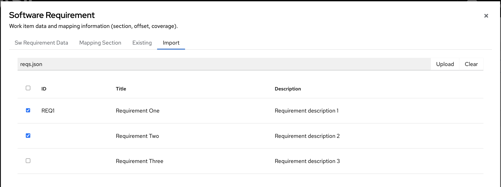

.. image:: ../../app/src/app/bgimages/basil_black.svg

Work Items Import
=================

BASIL provides a user interface to import work items from multiple file types.

Example files are available under **examples/import/**.

---------------------
Software Requirements
---------------------

BASIL Software Requirements have two properties: **title** and **description**.

BASIL supports import from following file types:

YAML
^^^^
Software Requirements can be defined in yaml format using a single dictionary as follows:

.. code-block:: yaml

   title: Software Requirement Example 1
   description: |
    Statement that describes software requirement example 1
    on multimple lines

or using list of dictionaries as follows:

.. code-block:: yaml

   - title: Software Requirement Example 1
     description: |
       Statement that describes software requirement example 1
       on multimple lines
   - title: Software Requirement Example 2
     description: |
       Statement that describes software requirement example 2
       on multimple lines

in both examples other properites can be populated. 

These properites will be discarded but the **id** one.

**id** is optional and will not propagated into BASIL database that has its own ids but will be proposed to the user to simplify requirements selection at the time of the import.

Here an example:

.. code-block:: yaml

   id: SW-REQ-XXX-1 # will be ignored as data but proposed at the import time
   created_at: 2025-05-12 # will be ignored
   owner: Micky Mouse  # will be ignored  
   title: Software Requirement Example 1
   description: |
    Statement that describes software requirement example 1
    on multimple lines

JSON
^^^^
As per YAML files, a Software Requirement can be defined in single dictionary as follows:

.. code-block:: json

   {"title": "Software Requirement Example 1",
    "description": "Statement that describes software requirement example 1"}

or using list of dictionaries as follows:

.. code-block:: json

   [
      {"title": "Software Requirement Example 1",
       "description": "Statement that describes software requirement example 1"},
      {"title": "Software Requirement Example 2",
       "description": "Statement that describes software requirement example 2"}
   ]

in both examples other properites can be populated. 

These properites will be discarded but the **id** one.

**id** is optional and will not propagated into BASIL database that has its own ids but will be proposed to the user to simplify requirements selection at the time of the import.

Here an example:

.. code-block:: json

   {"id": "SW-REQ-XXX-1",
    "created_at": "2025-05-12",
    "owner": "Micky Mouse",
    "title": "Software Requirement Example 1",
    "description": "Statement that describes software requirement example 1"}    

SPDX JSONLD
^^^^^^^^^^^
In BASIL user can export work items in jsonld SPDX SBOMs and same file can be used to import Software Requirements.

A BASIL Software Requirement is exported as the following example:

.. code-block:: json

    {
      "@type": "File",
      "@id": "SW-REQUIREMENT_1",
      "name": "SwReq1",
      "summary": "Software Requirement",
      "verifiedUsing": [
        {
          "@type": "Hash",
          "algorithm": "md5",
          "hashValue": "00f211e29f2e41e6d33edb844aca955d"
        }
      ],
      "attributionText": "{\"id\": 1, \"title\": \"SwReq1\", \"description\": \"description of sw requirement 1\", \"status\": \"NEW\", \"created_by\": \"useremail\", \"version\": \"1\", \"created_at\": \"2025-01-16 16:06\", \"updated_at\": \"2025-01-16 16:06\", \"__tablename__\": \"sw_requirements\"}"
    },

and it is recognized by the import tool using the **summary** field that should be equal to 'Software Requirement'.

All the information of the work item are reported as stringified json inside the **attributionText** field.

Other tools are also able to export Software Requirements in this format, StrictDoc is an example.

In the case of StrictDoc, the expected format is different from the one used by BASIL.

Requirements are exported in SPDX Snippets as follows:

.. code-block:: json

   {
      "@type": "Snippet",
      "@id": "SDOC-HIGH-REQS-MANAGEMENT",
      "name": "Requirement 'Requirements management'",
      "summary": "SPDX Snippet for requirement SDOC-HIGH-REQS-MANAGEMENT",
      "description": "StrictDoc shall enable requirements management.",
      "comment": "This snippet has been generated from a requirement defined in a StrictDoc file: hello.sdoc.",
      "verifiedUsing": [
        {
          "@type": "Hash",
          "algorithm": "sha256",
          "hashValue": "c14500147118475c1d43069f204a2a48b89a5eadbba8b4134bcaced66991ccd8"
        }
      ],
      "primaryPurpose": "documentation",
      "byteRange": {
        "@type": "PositiveIntegerRange",
        "begin": 29,
        "end": 164
      },
      "lineRange": {
        "@type": "PositiveIntegerRange",
        "begin": 4,
        "end": 8
      }
    }

BASIL will verify that the **name** field starts with 'Requirement' and will use the **name** and the **description** fields to populate a new Software Requirement.

XLSX
^^^^
BASIL can also read Software Requirements from spreadsheets.

It will look for column headers with mandatory values **title** and **description** and will list all the rows below the identified header.

Header row can contains other columns. These columns will be discarded but the **id** one.

**id** is optional and will not propagated into BASIL database that has its own ids but will be proposed to the user to simplify requirements selection at the time of the import.

.. toctree::
   :maxdepth: 1
   :caption: Contents:
